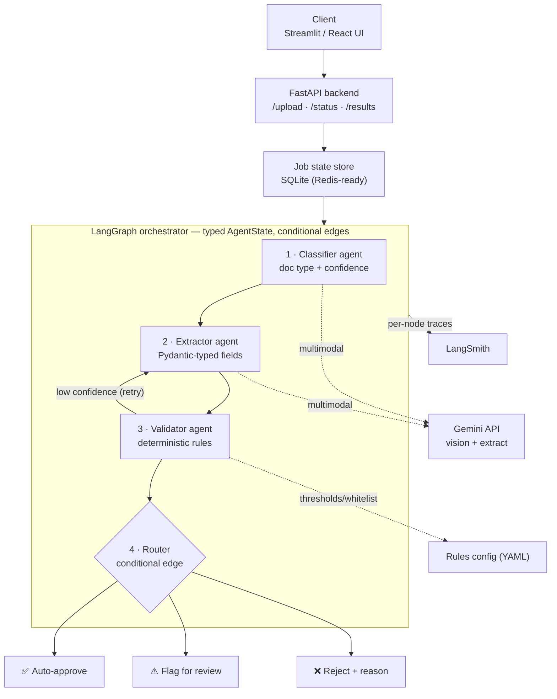

# 📄 SmartIngest — Agentic Document Intelligence Pipeline

> Upload an invoice, contract, resume or ID. SmartIngest **classifies** it,
> **extracts** structured fields, **validates** them against your business
> rules, and **routes** it — auto-approve, flag for review, or reject with a
> reason — all through a traced, multi-agent [LangGraph](https://langchain-ai.github.io/langgraph/) pipeline.

Built for the kind of bespoke invoice/document automation that companies pay
$200–500/month of SaaS for — but wired to *your* rules and workflow.

---

## Architecture



**The non-obvious design decisions** (see [`architecture.md`](architecture.md) for the full rationale):

- **Async decoupling** — `POST /upload` persists the file, enqueues a background job, and returns a `job_id` immediately. The client polls `/status/{job_id}`; the graph runs off the request thread.
- **Validator → Extractor retry loop** — a LangGraph *conditional edge* re-runs extraction when confidence is below threshold, up to a configurable retry budget.
- **Router is a deterministic conditional edge, not an LLM call** — routing decisions must be reproducible and explainable, so they come from typed rules in `config/rules.yaml`, not a prompt.
- **Mock-LLM mode** — the entire pipeline (and test-suite, and demo) runs offline with no API key. Set a real `GEMINI_API_KEY` to switch to genuine multimodal extraction.

---

## Quickstart

```bash
# 1. Install
make install                      # or: python3 -m venv .venv && .venv/bin/pip install -r requirements.txt
cp .env.example .env              # defaults to mock-LLM mode — runs with no API key

# 2. Run the tests
make test

# 3a. Try it from the CLI
make run                          # processes data/samples/invoice_acme.txt

# 3b. ...or the full stack
make api                          # FastAPI on http://localhost:8000  (docs at /docs)
make ui                           # Streamlit on http://localhost:8501
```

### Using real Gemini extraction

In `.env`, set:

```ini
SMARTINGEST_MOCK_LLM=false
GEMINI_API_KEY=your-key-here
GEMINI_MODEL=gemini-2.0-flash
```

### Enabling LangSmith tracing

```ini
LANGSMITH_TRACING=true
LANGSMITH_API_KEY=your-langsmith-key
LANGSMITH_PROJECT=smartingest
```

Every node run (Classifier, Extractor, Validator, Router) then appears as a
traced step in your LangSmith project — the production-monitoring signal that
matters for real deployments.

---

## API

| Method | Endpoint             | Description                                          |
|--------|----------------------|------------------------------------------------------|
| `POST` | `/upload`            | Upload a document; returns `{ job_id, status }`.     |
| `GET`  | `/status/{job_id}`   | Poll job status (`queued`/`running`/`completed`/`failed`). |
| `GET`  | `/results/{job_id}`  | Full `PipelineResult` (fields, issues, route).       |
| `GET`  | `/healthz`           | Liveness probe.                                      |

Interactive OpenAPI docs are served at `/docs`.

Example:

```bash
curl -F "file=@data/samples/invoice_acme.txt" http://localhost:8000/upload
# {"job_id":"abc123...","status":"queued","filename":"invoice_acme.txt"}
curl http://localhost:8000/results/abc123...
```

---

## Project layout

```
SmartIngest/
├── README.md              ← you are here
├── architecture.md        ← detailed technical decisions
├── demo/                  ← screenshots + Loom link
├── config/rules.yaml      ← business rules (thresholds, vendor whitelist)
├── data/samples/          ← example documents
├── src/
│   ├── smartingest/
│   │   ├── api.py          ← FastAPI app (upload/status/results)
│   │   ├── graph.py        ← LangGraph StateGraph assembly
│   │   ├── state.py        ← typed AgentState
│   │   ├── models.py       ← Pydantic contracts
│   │   ├── llm.py          ← Gemini client + offline mock
│   │   ├── rules.py        ← rules loader
│   │   ├── store.py        ← SQLite job store
│   │   ├── worker.py       ← background pipeline worker
│   │   ├── tracing.py      ← LangSmith wiring
│   │   ├── cli.py          ← single-document CLI
│   │   └── agents/         ← classifier / extractor / validator / router
│   └── frontend/streamlit_app.py
├── tests/                 ← pytest suite (28 tests)
└── requirements.txt
```

## Tech stack

LangGraph · Gemini API (multimodal) · FastAPI · Pydantic v2 · LangSmith · Streamlit · SQLite

## Testing

```bash
make test        # 28 tests: unit (agents, rules, store) + end-to-end (graph, API)
```

The suite runs entirely in mock-LLM mode, so it needs no API key or network.
