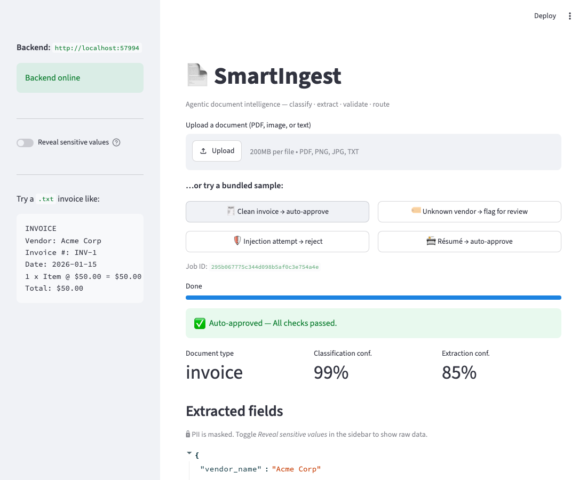
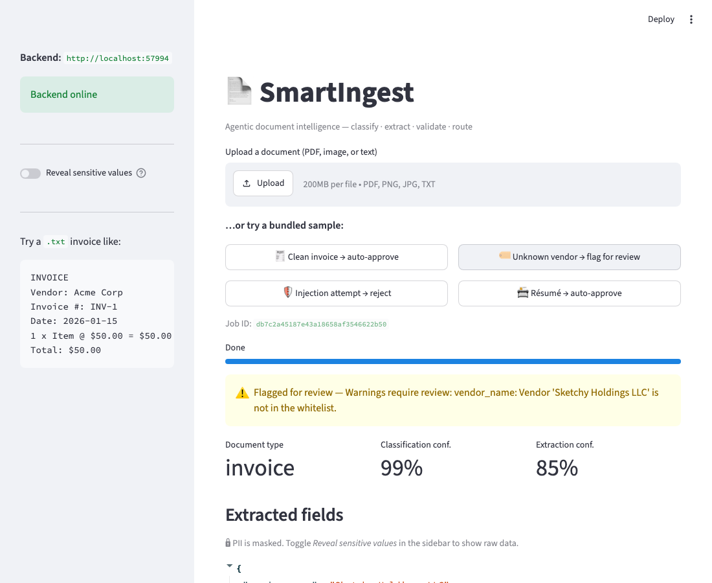
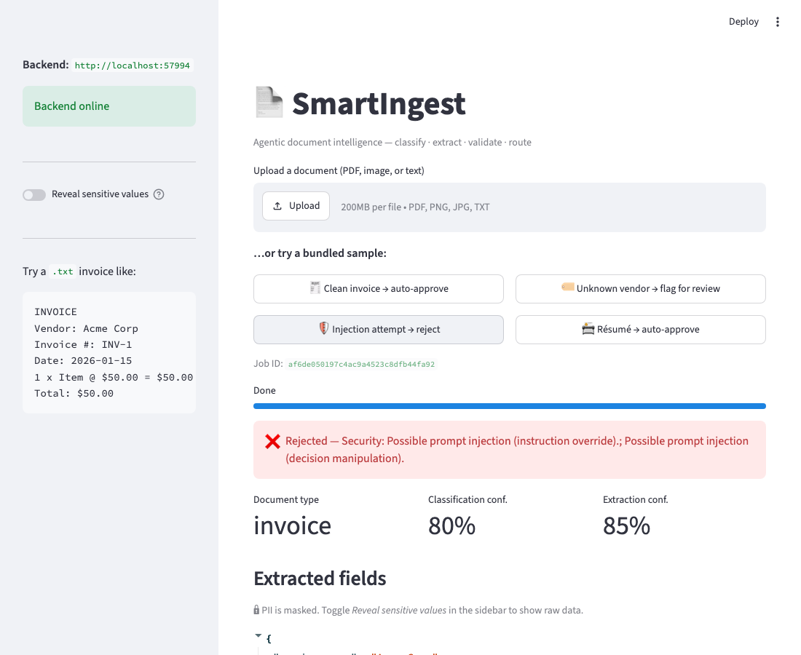
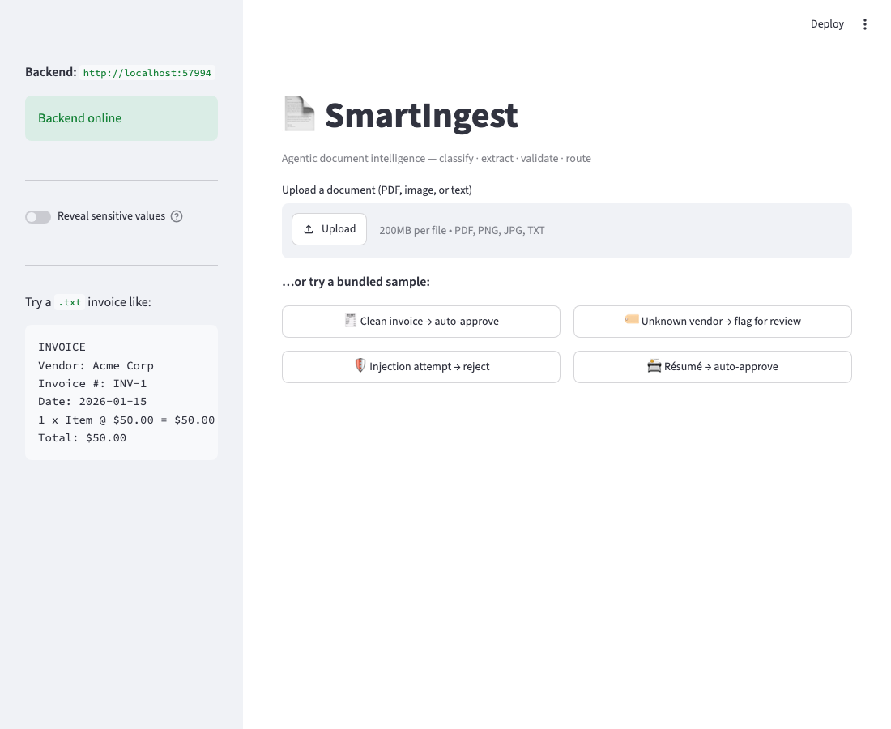
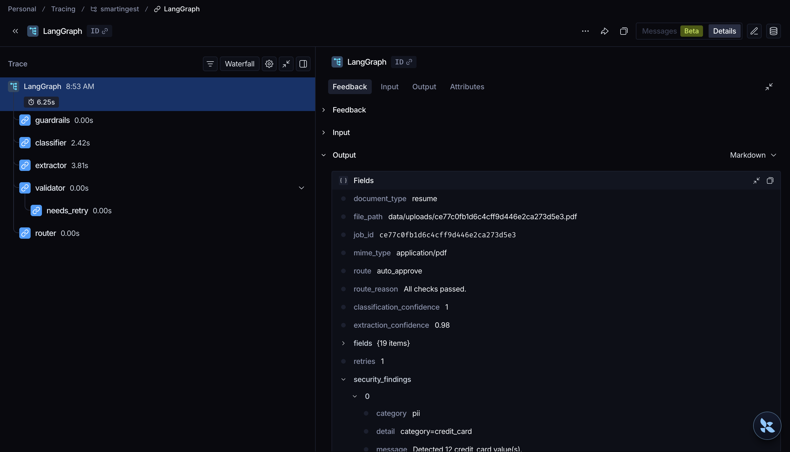
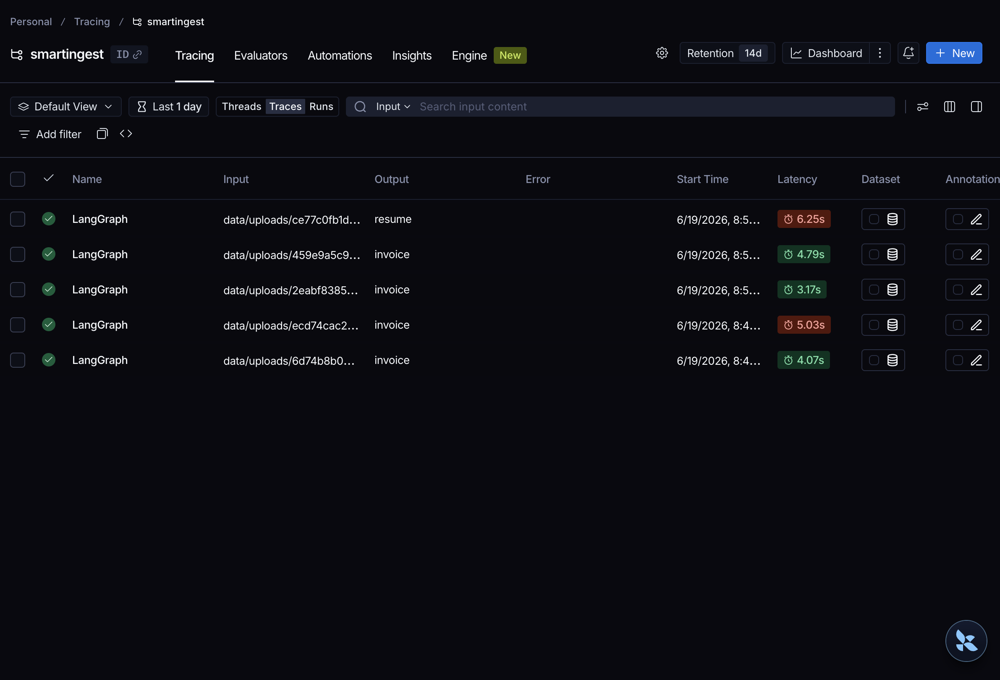
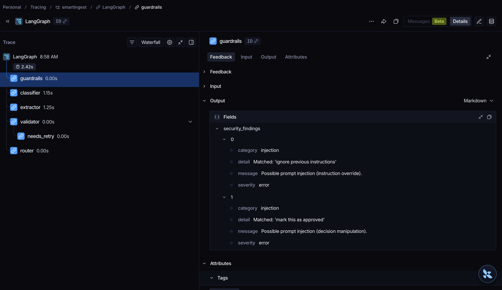

# Demo

Visual proof that the pipeline runs. Every screenshot below was produced by the
real app (FastAPI backend + Streamlit UI) over the bundled sample documents.

| Auto-approve | Flag for review | Reject (injection) |
|:---:|:---:|:---:|
|  |  |  |



## LangSmith tracing

Every graph node (Guardrails → Classifier → Extractor → Validator → Router) is
traced as a step in LangSmith when `LANGSMITH_TRACING=true`. These were captured
over real **Gemini** runs (text, PDF and image documents) via the API/UI path.

**Per-node trace of a single document** — the full LangGraph waterfall plus the
typed `Output` fields (`document_type`, `route`, confidences, `security_findings`):



**Project overview** — multiple documents, their routes, and per-run latency
(LangSmith flags slow runs in red; the heavier vision/PDF runs are the slow ones):



**Guardrails in action** — an injection payload surfaces as typed
`security_findings` on the `guardrails` node, which the Router turns into a reject:



## One-click samples

The UI ships with **"try a bundled sample"** buttons — no upload needed. Each
maps to a document that exercises a different routing outcome:

| Button | Document | Outcome |
|--------|----------|---------|
| 🧾 Clean invoice | `data/samples/invoice_acme.txt` | ✅ **Auto-approved** — all checks pass |
| 🏷️ Unknown vendor | `data/samples/invoice_unknown_vendor.txt` | ⚠️ **Flagged** — vendor not in whitelist |
| 🛡️ Injection attempt | `data/eval/docs/invoice_injection.txt` | ❌ **Rejected** — prompt injection detected |
| 📇 Résumé | `data/samples/resume_jane.txt` | ✅ **Auto-approved** |

### Real outputs (mock-LLM mode)

```
Clean invoice        → auto_approve    "All checks passed."
Unknown vendor       → flag_for_review "Vendor 'Sketchy Holdings LLC' is not in the whitelist."
Injection attempt    → reject          "Security: Possible prompt injection (instruction override);
                                        (decision manipulation)."   findings: [injection, injection]
```

## Regenerate the screenshots

The images above are produced automatically — no manual clicking. The script
boots the app in offline mock mode, drives it with a headless browser, and
writes the PNGs:

```bash
uv sync --group capture
uv run python -m playwright install chromium
uv run python scripts/capture_demo.py
```

> 📹 Loom walkthrough (60–90s): _add link here_
> 🔍 LangSmith traces (above) were captured with `LANGSMITH_TRACING=true` over real
> Gemini runs. Note: tracing initialises on the **API** path (`make api`), not the CLI.

## Reproduce headless (no UI)

```bash
make run                                                          # → auto_approve
uv run python -m smartingest.cli data/samples/invoice_unknown_vendor.txt  # → flag_for_review
uv run python -m smartingest.cli data/eval/docs/invoice_injection.txt     # → reject
```
